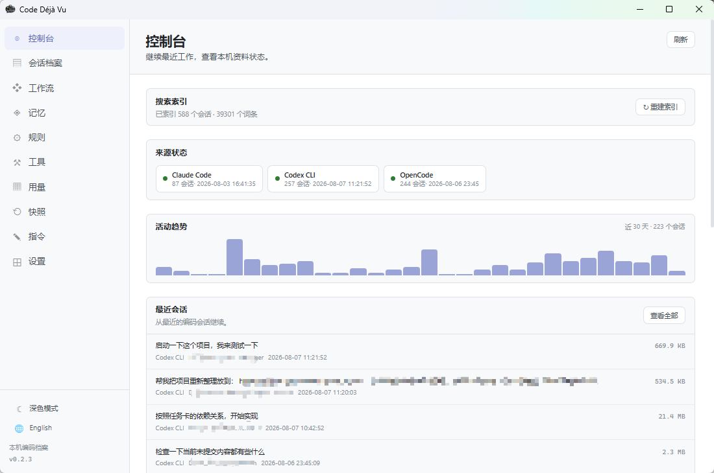

# Code Déjà Vu

Code Déjà Vu 是一个基于 Tauri、SvelteKit 与 Rust 的本地桌面工具，用于统一浏览和管理
Claude Code、Codex CLI 与 OpenCode 留在本机的会话、指令和配置资料。



[📖 操作指南](docs/USER_GUIDE.md) · [⬇️ 下载最新版](https://github.com/jnchen/code_dejavu/releases/latest)

> 项目仍在早期阶段。使用会修改本地配置或归档资料的功能前，请先备份相关目录。

## 功能

- 统一浏览多种 coding agent 的会话和子代理记录
- 本地索引、全文检索、会话内搜索与用量统计
- 查看和编辑项目指令、记忆、规则与工具定义
- 创建、恢复和管理配置快照
- 从终端恢复受支持的历史会话
- 中文与英文界面、浅色与深色主题

会话解析、搜索索引和配置管理均在本机完成。应用不会把会话内容上传到项目维护者的
服务；手动检查更新时会访问 GitHub Release 更新地址。

## 技术栈

- [Tauri 2](https://tauri.app/)
- [SvelteKit 2](https://svelte.dev/docs/kit/introduction)
- [Rust](https://www.rust-lang.org/)
- [TypeScript](https://www.typescriptlang.org/) 与 [Tailwind CSS 4](https://tailwindcss.com/)

## 本地开发

先安装 Node.js 当前 LTS、pnpm、Rust stable，以及 Tauri 对应平台的系统依赖。

```powershell
git clone https://github.com/jnchen/code_dejavu.git
cd code_dejavu
pnpm install --frozen-lockfile
pnpm tauri dev
```

常用检查：

```powershell
pnpm check
pnpm build
cargo test --manifest-path src-tauri/Cargo.toml
```

正式构建：

```powershell
pnpm tauri build
```

如需生成带签名的更新包，请阅读 [`docs/RELEASING.md`](docs/RELEASING.md)。签名私钥和
密码只能保存在仓库外部。

## 目录

```text
src/                 SvelteKit 前端
src-tauri/src/       Rust 后端、provider 与 Tauri commands
src-tauri/icons/     桌面和移动端应用图标
docs/                设计与发布文档
scripts/             发布辅助脚本
static/              前端静态资源
```

## 数据与安全

- 不要提交 `.env`、签名密钥、构建日志、安装包或真实 agent 会话。
- `release_packages/`、Rust `target/`、前端构建目录和日志均已加入忽略规则。
- 工具配置接口只展示环境变量或 Header 的键名，不返回其中的敏感值。
- 发现安全问题请按 [`SECURITY.md`](SECURITY.md) 私下报告。

## 参与贡献

请先阅读 [`CONTRIBUTING.md`](CONTRIBUTING.md)。主要设计文档位于 [`docs/`](docs/)。

## 许可证

[MIT](LICENSE)

## 社区

本项目在 [Linux.do](https://linux.do/) 发布与讨论——[一个真诚、友善、团结、专业的技术交流社区](https://linux.do/)。
